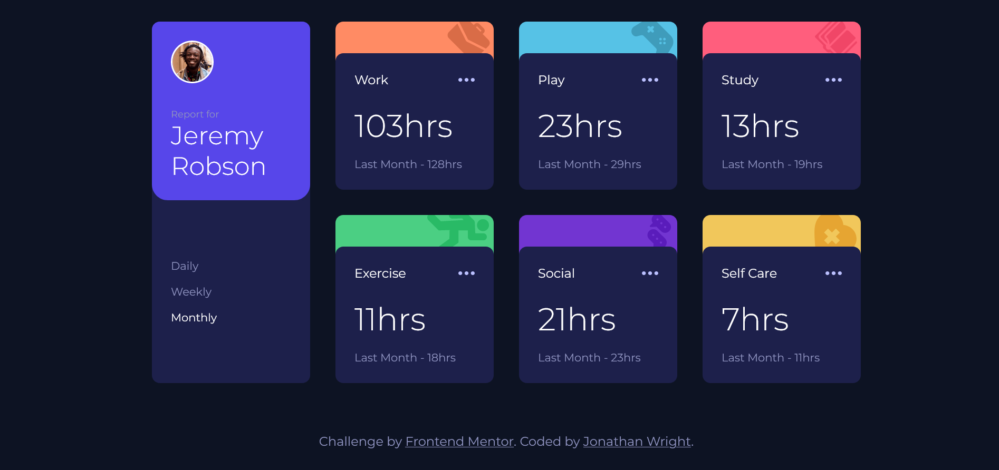

# Frontend Mentor - Time tracking dashboard solution

This is a solution to the [Time tracking dashboard challenge on Frontend Mentor](https://www.frontendmentor.io/challenges/time-tracking-dashboard-UIQ7167Jw). Frontend Mentor challenges help you improve your coding skills by building realistic projects. 

## Table of contents

- [Overview](#overview)
  - [The challenge](#the-challenge)
  - [Screenshot](#screenshot)
  - [Links](#links)
- [My process](#my-process)
  - [Built with](#built-with)
  - [What I learned](#what-i-learned)
- [Author](#author)

## Overview

### The challenge

Users should be able to:

- View the optimal layout for the site depending on their device's screen size
- See hover states for all interactive elements on the page
- Switch between viewing Daily, Weekly, and Monthly stats

### Screenshot



### Links

- Solution URL: [https://github.com/Dr-Wrong-Mo/FEM-time-tracking-dashboard](https://github.com/Dr-Wrong-Mo/FEM-time-tracking-dashboard)
- Live Site URL: [https://fem-time-tracking.netlify.app/](https://fem-time-tracking.netlify.app/)

## My process

I wanted to use Webpack for this project so that I could leverage SCSS and use JavaScript modules so I could keep my code a bit cleaner.

Once I had my dev environment setup, I began with considering the relationships of different elements and began creating my HTML body, using BEM notation for my classes. Next, I started writing my CSS, taking advantage of SASS nesting and imports. When I was finally happy with the layout, I used JavaScript to load the data from a JSON file and update the DOM.

### Built with

- Semantic HTML5 markup
- [Webpack](https://webpack.js.org/) - Static Module Bundler
- SCSS
- Flexbox
- CSS Grid
- Desktop-first workflow
- Imported JSON data

### What I learned

While the HTML and CSS were fairly straightforward to me, there were two things that I hadn't previously had the occasion to do in JavaScript, so they required a bit more thought and research:

1. I wanted the cards to be in a specific order, so I hard coded some data, but I wanted to approach the JSON data without the assumption that the data would always be delivered in the same order as the cards. I looped through the NodeList of cards. For each item, I looped through the array of items that I had created with the JSON data, comparing the category names of each and sending the index of each element to a function that would then render the data to the DOM.

```js
// FUNCTION WILL GET INDEX OF OBJECT IN dataArray, BASED ON VALUE OF object.title
// CAN BE USED TO MAP TO CARDS NODE LIST
function getObjectIndex(category) {
  const index = dataArray.findIndex((object) => {
    return category.includes(object.title);
  });
  return index;
}

function updateAllCards() {
  // Loops through cards and finds the index of corresponding data object
  cards.forEach((element, idx) => {
    const categoryName = element.childNodes[0].childNodes[0].data;
    const IDXofDataObj = getObjectIndex(categoryName);

    // Send card index and object index to function to update a card
    updateSingleCard(idx, IDXofDataObj);
  });
}
```

1. In order to update the data when the user changes the view between daily, weekly and monthly, I needed to use a variable to select the correct object key. This was not a difficult bit of code by any means, but I hadn't done it, so I did have to search the correct syntax.

```js
// Gets correct timeframe based on the range the user selects using the variable 'range'
  const dataTimeframe = data[obj].timeframes[range.toLocaleLowerCase()];
```

## Author

- Website - [Jonathan Wright](https://dr-wrong-mo.github.io/)
- Frontend Mentor - [@Dr-Wrong-Mo](https://www.frontendmentor.io/profile/Dr-Wrong-Mo)
